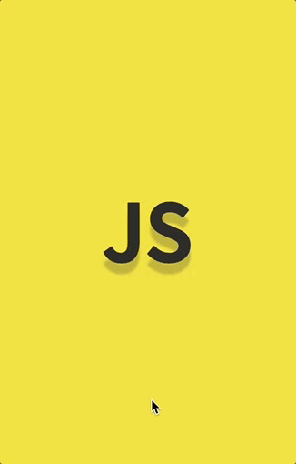

# Save Favourites in Local Storage

A simple demo app where css is being updated when the user moves the cursor around the screen.

Live version: https://css-follows-mouse.herokuapp.com



## Tech stack
* Node
* Express
* Heroku
* Vanilla JavaScript
* ES6
* Flexbox

## Getting started

```sh
git clone https://github.com/PiotrBerebecki/css-follows-mouse.git
cd css-follows-mouse
npm install

#1. Start the app
npm start

#2. Open this url in your browser: http://localhost:3000
```
